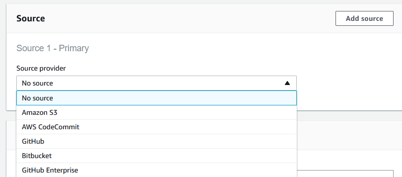

# Google

## Integration with different VCS with CodeBuild

Supported in console:

- Amazon S3
- AWS CodeCommit
- Github and Github Enterprise
- Bitbucket

Similar with gcloud, gitlab can also be used with to start builds.
Two possible ways are:
- aws console and ci script that pushes changes
- aws fargate with coordinators that push into an aws S3 bucket which triggers a vloud build
- aws lambda function that pushes into a bucket

## Github actions + aws

## Github 

### Overview:

### Pricing

<https://calculator.aws/#/>
<https://aws.amazon.com/amazon-linux-2/>

The AWS CodeBuild free tier includes 100 build minutes of build.general1.small per month. The CodeBuild free tier does not expire automatically at the end of your 12-month AWS Free Tier term. It is available to new and existing AWS customers.

#### CodeBuild

| Compute instance type 	| Memory 	| vCPU 	| Linux price per build minute 	| Windows price per build minute 	|
|:-:	|:-:	|:-:	|:-:	|:-:	|
| general1.small 	| 3 GB 	| 2 	| $0.005 	| N/A 	|
| general1.medium 	| 7 GB 	| 4 	| $0.01 	| N/A 	|
| arm1.large 	| 16 GiB 	| 8 	| $0.0175 	| N/A 	|
| general1.large 	| 15 GB 	| 8 	| $0.02 	| N/A 	|
| general1.2xlarge 	| 144 GiB 	| 72 	| $0.25 	| N/A 	|
| gpu1.large 	| 244 GiB 	| 32 	| $0.80 	| N/A 	|

You may incur additional charges if your builds transfer data or use other AWS services. For example, you may incur charges from Amazon CloudWatch Logs for build log streams, Amazon S3 for build artifact storage, and AWS Key Management Service for encryption. You may also incur additional charges if you use AWS CodeBuild with AWS CodePipeline.

If you want to use the secret manager:

Pricing
$0.40 per secret per month
$0.05 per 10,000 API calls

#### Container Registry

<https://console.aws.amazon.com/ecr/home?region=us-east-1#>
<https://aws.amazon.com/ecr/pricing/>

AWS Free Tier
As part of the AWS Free Tier, new Amazon ECR customers get 500 MB-month of storage for one year for your private repositories.

As a new or existing customer, Amazon ECR offers you 50 GB-month of always-free storage for your public repositories. You can transfer 500 GB of data to the internet for free from a public repository each month anonymously (without using an AWS account.) If you sign up for an AWS account, or authenticate to ECR with an existing AWS Account, you can transfer 5 TB of data to the internet for free from a public repository each month, and you get unlimited bandwidth for free when transferring data from a public repository to AWS compute resources in any AWS Region.

 Storage:
    Storage is $0.10 per GB-month for data stored in private or public repositories.

Data transferred from private repositories:

|  	| Pricing 	|
|:-:	|:-:	|
| Data Transfer IN 	|  	|
| All data transfer in 	| $0.00 per GB 	|
| Data Transfer OUT ** 	|  	|
| Up to 1 GB / Month 	| $0.00 per GB 	|
| Next 9.999 TB / Month 	| $0.09 per GB 	|
| Next 40 TB / Month 	| $0.085 per GB 	|
| Next 100 TB / Month 	| $0.07 per GB 	|
| Greater than 150 TB / Month 	| $0.05 per GB 	|

Prices for public repositories:
|  	| Pricing 	|
|:-:	|:-:	|
| Greater than 5 TB / Month to non AWS Regions  	| $0.09 per GB |

Data transfer "in" and “out” refers to transfer into and out of Amazon Elastic Container Registry. Data transferred between Amazon Elastic Container Registry and Amazon EC2 within a single region is free of charge (i.e., $0.00 per GB). Data transferred between Amazon Elastic Container Registry and Amazon EC2 in different regions will be charged at Internet Data Transfer rates on both sides of the transfer.

### Steps

#### Create Trigger

1. Go to AWS CodeBuild
2. Create a new build project
3. Select a project name
4. Select your VCS Repository (Github)
   1. If Github is not allowed access yet, you can select repositories that AWS has access to
5. Add a webhook event
   1. Add condition for a new tag push -> HEAD_REF : `^refs/tags/v\d+\.\d+\.\d+`  
   2. Add another filter group for pull requests
6. Manage the environment, [amazon linux 2](https://aws.amazon.com/amazon-linux-2/) is the recommended system as it provides packages and configurations with many aws tools
   1. Set the privileged flag as we want to build docker images
7. Additional specifications can be set for the build vm
   1. Timeouts, resources, certificates, file systems ..
8. Add environment variables
   1. You have the option to use it as plaintext, parameter or with the secrets manager
9. Artifacts are not produced by our build, or rather they are pushed to the docker registry and as such we will not have any artifacts that should be saved
10. Select CloudWatch logs, as they provide additional insight into how many builds failed and more important stats.

In AWS ECR, you can have only have one repository per image but each repository can have multiple versions of a single image.
In our case we have to create 3 repositories

#### Building with cloudbuild.yaml

<https://docs.aws.amazon.com/codebuild/latest/userguide/build-spec-ref.html>

Few issues you might have:
- Incorrect policies set for cloudbuild
  - <https://docs.aws.amazon.com/codebuild/latest/userguide/setting-up.html#setting-up-service-role>
  - <https://docs.aws.amazon.com/systems-manager/latest/userguide/sysman-paramstore-access.html>
  - <https://docs.aws.amazon.com/AmazonECR/latest/userguide/repository-policies.html>
- Retry build fails
  - Changes to environment variables are not updated for a build that is restarted even if different values for parameters are shown in the build job (likely a bug)