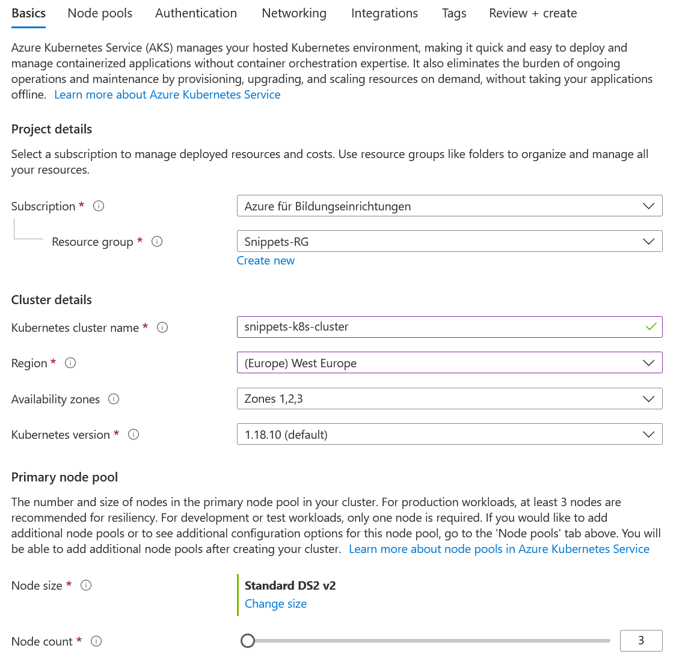

# Pipeline

For pricing see [here](https://azure.microsoft.com/en-us/pricing/details/devops/azure-devops-services/).  

**Some interesting links:**

- [Release Pipeline triggers](https://docs.microsoft.com/en-us/azure/devops/pipelines/release/triggers?view=azure-devops)
- [Deployment Environment Strategies](https://docs.microsoft.com/en-us/azure/app-service/deploy-best-practices)
- [SonarQube Integration](https://www.azuredevopslabs.com/labs/vstsextend/sonarcloud/)
- [Teams Integration](https://azuredevopslabs.com/labs/vstsextend/teams/)

## Pipeline for AAS (Azure App Service)

1. Create ContainerRegistry in Azure  (Same as in AKS)
2. Create PostgreSQL
3. Create Azure App Service
4. Create a Build Pipeline in AzureDevops
5. Create a Release Pipeline in AzureDevops

## 1. Create Container Registry (Duplicated)

For detailed instructions see the same section in Azure Kubernetes Service

## 2. Create PostgreSQL

1. Search Azure Marketplace for 

---
---
---
---
---

## Pipeline for AKS (Azure Kubernetes Service)

For a CI/CD pipeline 3 abstract steps are needed.  
First we need a ContainerRegistry to save the build images.  
Second step is to create a k8s cluster to where we can deploy.
Third step is to connect the code repo with Azure Devops to trigger the build.  

1. Create ContainerRegistry in Azure
2. Create K8S cluster
3. Create a Build Pipeline in AzureDevops
4. Create a Release Pipeline in AzureDevops

## 1. Create Container Registry

1. Go to [Azure](https://portal.azure.com)
2. Select the Resource Group you want to use
3. Click Add
4. Select Container Registry (see image)
5. 
6. Select a name, the location and the SKU (Basic just fine)
7. 
8. Press create + review
9. Press again create
10. After creation press "Go to resource"

Now we need a way to access the registry:

1. Go to "Settings" -> "Access keys"
2. Enable Admin user
3. 

## 2. Create Kubernetes Cluster

1. Go to [Azure](https://portal.azure.com)
2. Select the Resource Group you want to use
3. Click Add
4. Select "Kubernetes Service"
5. 
6. Configure the Kubernetes Cluster
7. 
8. 
9. Click Create + Validate
10. Create Cluster

> With the student license you have a quota on vcpus. By exceeding this quota a deployment is not possible.

## 3. Create Pipeline

YML file description: [documentation](https://docs.microsoft.com/en-us/azure/devops/pipelines/yaml-schema?view=azure-devops&tabs=example%2Cparameter-schema)

1. Go to [Azure Devops](https://dev.azure.com/)
2. Create Project (Add project name and description. Select Visibility)
3. 
4. Pipelines -> Create Pipeline
5. Select the Version Control System (our case GitHub)
6. 
7. We just want to build and push to docker registry 
   1. Select Docker (Build and push an image to Azure Container Registry)
8. 
9. Select the Azure subscription
10. Select the Container Registry + Image Name + Dockerfile
    1. As we currently only have the possibility to enter a Dockerfile this step is not important.
    2. We just update the values later on in the yml file.

**YML configuration:**

1. Click on the top right corner on "Show assistant"
2. Search for "Docker Compose" and select it
3. 
4. Fill in Azure subscription and **Authorize**
5. 
6. Fill out the needed fields & **REPEAT** same for action "PUSH"
7. 
8. Next we need to copy the kubernetes deployment file to a persistent directory
9. 
10. Enter source file and target path:
11. 
12. Know publish the copied file
13. 
14. Configure it as you like:
15. 
16. Save and run

## 4. Create a Release Pipeline in Azure DevOps

Know that we have created a build pipeline we need a new pipeline to deploy the changes.

1. Go to "Pipelines" -> "Releases"
2. Click on "New pipeline"
3. 
4. Select the "Empty job" - We will create it from scratch.
5. And enter a name for the Stage.
6. 
7. Next we need to define from where we get the artifact (which we published in the build pipeline)
8. Click therefore on "Add" new artifact, select the project, build pipeline, ...
9. 
10. Now we need to define, when the release pipeline should be executed
11. 
12. Next up: Configure the job
13. Switch to the "Tasks" tab, select the agent job and change the OS to ubuntu-20.04
14. 
15. Add 2 times the "Kubectl" task. One for applying the deployment file and one for updating the image
16. 
17. Configure the 2 Kubectl commands as follows:
18. 
18. 

**ImagePullSecret:**
Before we can start, we need to create a "ImagePullSecret" in order for Kubernetes to pull
the image from the Azure Container Registry:

Open therefore either the CloudShell or the local CMD (if its connected to azure) and type in 
the following command:

> kubectl create secret docker-registry \$(Name-for-the-secret)  
>   --docker-server=\$(URL-to-your-ACR)  
>   --docker-username=\$(ACR-Access-Username)  
>   --docker-password=\$(ACR-Access-Password)  
>   --docker-email=\$(Any-valid-EMail)

Paste the name of the secret in your kubernetes deployment file.

## Useful stuff

**Supported Repositories:**
- Azure Repos Git
- Bitbucket Cloud
- GitHub
- GitHub Enterprise Server
- Other Git
- Subversion

**Build Triggers:**
- [GitHub](https://docs.microsoft.com/en-us/azure/devops/pipelines/repos/github?view=azure-devops&tabs=yaml#ci-triggers)
  - Specific branches
  - Specific tags
  - PRs
  - PR Comment triggers
  - None
