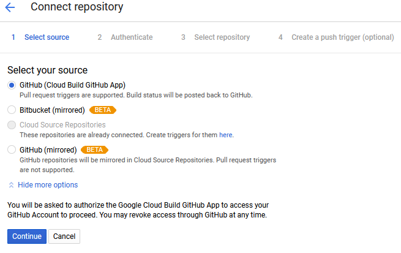
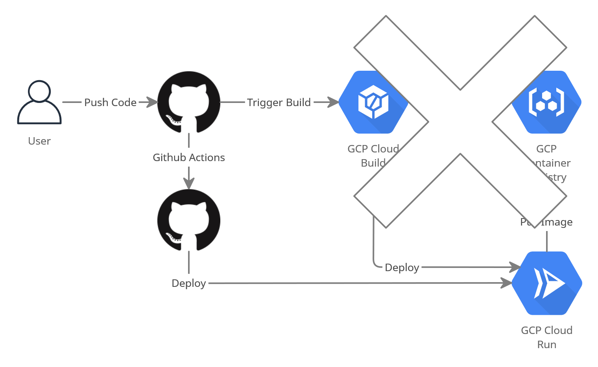
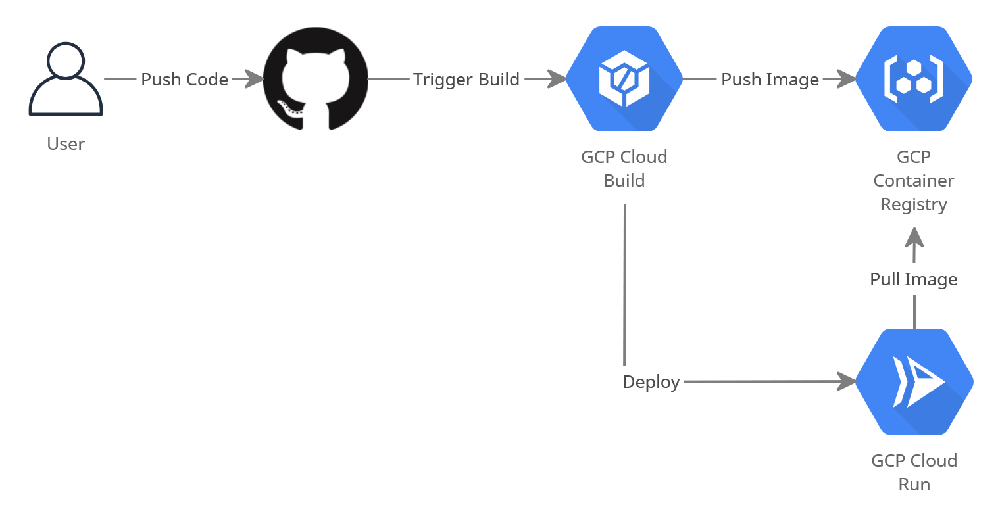

# Google

## Integration with different VCS with Cloud Build



Supported in console:

- GCloud
- Github
- Bitbucket (only mirrored)

It is possible however, to run gcloud build from scripts. So it is possible to use gitlab given a valid gitlab ci configuration file.
Example of a gitlab ci file:

```yaml
image: docker:latest

stages:
  - deploy

deploy:
  stage: deploy
  image: google/cloud-sdk
  services:
    - docker:dind
  script:
    - echo $GCP_SERVICE_KEY > gcloud-service-key.json # Google Cloud service accounts
    - gcloud auth activate-service-account --key-file gcloud-service-key.json
    - gcloud config set project $GCP_PROJECT_ID
    - gcloud builds submit . --config=cloudbuild.yaml
```

## Github actions + gcloud

<https://medium.com/mistergreen-engineering/uploading-a-docker-image-to-gcr-using-github-actions-92e1cdf14811>

<https://medium.com/mistergreen-engineering/deploying-google-cloud-run-to-different-environments-with-github-actions-2a7b748f3564>

<https://medium.com/google-cloud/creating-a-ci-cd-environment-for-serverless-containers-on-google-cloud-run-with-github-actions-7492ca3993a0>



## Github + Cloud Build + Container Registry + Cloud Run

### Overview:



1. Developer checks in the source code to a Version Control system such as GitHub
2. GitHub triggers a post-commit hook to Cloud Build.
3. Cloud Build builds the container image and pushes to Container Registry.
4. Cloud Build then notifies Cloud Run to redeploy
5. Cloud Run pulls the latest image from the Container Registry and runs it.

Cloud Build, Cloud Run and Google Container Registry APIs need to be enabled.

### Pricing

<https://console.cloud.google.com/apis/library/cloudbuild.googleapis.com?q=cloud%20build&id=9472915e-c82c-4bef-8a6a-34c81e5aebcc&project=snippets-299912&supportedpurview=project>  
<https://cloud.google.com/cloud-build/pricing>

#### Cloud Build

Free:
Limited to 120 build minutes / day on n1-standard-1 VM per billing account.

| Tier 	| Cost / minutes of build time 	|
|-	|-	|
| n1-standard-1 VM 	| 0.002520149 	|
| n1-highcpu-8 VM 	| 0.013440799 	|
| n1-highcpu-32 VM 	| 0.053763199 	|

| Extras 	| Costs 	|
|-	|-	|
| SSD disk for build time 	| 0.142808499 / gibibytes per month  	|
| Custom workers N1-family allocated vCPU 	| 0.002662958 / vCPU per minute of build time 	|
| Custom workers N1-family allocated RAM 	| 0.00035282 / gigabytes RAM per minute of build time 	|
| Custom workers allocated SSD 	| 0.142808499 / gibibytes SSD per month of build time 	|

Prices may vary and can be checked here:

- <https://cloud.google.com/cloud-build/pricing>

Note:  
gibibyte: 2^30 in binary -> 1,073,741,824 bytes  
gigabyte: 10^9 in decimal -> 1,000,000,000 bytes  

#### Container Registry

<https://cloud.google.com/container-registry/pricing>

The first time you push an image to Container Registry, the system creates a Cloud Storage bucket to store all of your images. You are charged for this storage.

The default storage class is standard, there are other available though:  
<https://cloud.google.com/storage/docs/storage-classes#standard>

| Storage Class 	| Name for APIs and gsutil 	| Minimum storage duration 	| Typical monthly availability1 	|
|:-:	|:-:	|:-:	|:-:	|
| Standard Storage 	| STANDARD 	| None 	| >99.99% in multi-regions and dual-regions 99.99% in regions 	|
| Nearline Storage 	| NEARLINE 	| 30 days 	| 99.95% in multi-regions and dual-regions 99.9% in regions 	|
| Coldline Storage 	| COLDLINE 	| 90 days 	| 99.95% in multi-regions and dual-regions 99.9% in regions 	|
| Archive Storage 	| ARCHIVE 	| 365 days 	| 99.95% in multi-regions and dual-regions 99.9% in regions 	|

Pricing for these (Frankfurt (europe-west3)):  
<https://cloud.google.com/storage/pricing#storage-pricing>

| Standard Storage (per GB per Month) 	| Nearline Storage (per GB per Month) 	| Coldline Storage (per GB per Month) 	| Archive Storage (per GB per Month) 	|
|:-:	|:-:	|:-:	|:-:	|
| $0.023 	| $0.013 	| $0.006 	| $0.0025 	|

And you get charged for network egress -> egress is to other Cloud Storage buckets or to Google Cloud services.

Most usages are free (for example when data moves within the same location US-EAST1 to US-EAST1), some cases can cost extra:

| Case 	| Examples 	| Rate 	|
|:-:	|:-:	|:-:	|
| Data moves between different locations on the same continent         (assuming none of the above free cases apply) 	| US-EAST1 to NORTHAMERICA-NORTHEAST1           A NAM4 bucket to a US-EAST1 bucket           A US-CENTRAL1 bucket to a US bucket 	| $0.01/GB 	|
| Data moves between different continents and neither is Australia. 	| US to ASIA           EU-WEST1 to SOUTHAMERICA-EAST1 	| See General network usage table. 	|
| Data moves between different continents and one is Australia. 	| US to AUSTRALIA-SOUTHEAST1           AUSTRALIA-SOUTHEAST1 to EU-WEST1 	| See General network usage table. 	|

General network usage:

| Monthly Usage 	| Egress to Worldwide Destinations (excluding Asia & Australia) (per GB) 	| Egress to Asia Destinations (excluding China, but including Hong Kong) (per GB) 	| Egress to China Destinations (excluding Hong Kong) (per GB) 	| Egress to Australia Destinations  (per GB) 	| Ingress 	|
|:-:	|:-:	|:-:	|:-:	|:-:	|:-:	|
| 0-1 TB 	| $0.12 	| $0.12 	| $0.23 	| $0.19 	| Free 	|
| 1-10 TB 	| $0.11 	| $0.11 	| $0.22 	| $0.18 	| Free 	|
| 10+ TB 	| $0.08 	| $0.08 	| $0.20 	| $0.15 	| Free 	|

### Steps

#### Create Trigger

1. Go to Cloud Build
2. Click Connect Repository
3. Select your VCS Repository (Github)
   1. If Github is not allowed access yet, you can select repositories that gcloud has access to

4. Specify the Name, Event (tag, normal push or pr) and Build configuration
   1. the cloudbuild.yaml is primarily used to specify actions
   2. Another option is to select a dockerfile where you can specify image name and build context
      1. Example for name: `gcr.io/snippets-299912/github.com/andreasroither/snippets:$COMMIT_SHA`
      2. `$PROJECT_ID,$REPO_NAME,$BRANCH_NAME,$TAG_NAME,$COMMIT_SHA,$SHORT_SHA` are supported for image names

5. Ensure Cloud Build has access to deploy to Cloud Run -> Enable the service account permission for Cloud Run under Settings in Cloud Build (Service Accounts might be required as well).

#### Building with cloudbuild.yaml

Start the build using the build config file with the console:  
`gcloud builds submit --config CONFIG_FILE_PATH SOURCE_DIRECTORY`

Substituting variable values:  
<https://cloud.google.com/cloud-build/docs/configuring-builds/substitute-variable-values>

To build, push and deploy a container in cloud run:  
cloudbuild.yaml:

```yaml
steps:
# Build the container image
- name: 'gcr.io/cloud-builders/docker'
  args: [ 'build', '-t', 'gcr.io/PROJECT_ID/IMAGE_NAME', '-f', 'DOCKERFILE_PATH', '.' ]
# Push the container image to Container Registry
- name: 'gcr.io/cloud-builders/docker'
  args: ['push', 'gcr.io/PROJECT_ID/IMAGE']
# Deploy container image to Cloud Run
- name: 'gcr.io/google.com/cloudsdktool/cloud-sdk'
  entrypoint: gcloud
  args: ['run', 'deploy', 'SERVICE-NAME', '--image', 'gcr.io/PROJECT_ID/IMAGE', '--region', 'REGION', '--platform', 'managed']
images:
- gcr.io/PROJECT_ID/IMAGE
```

Where:

- `SERVICE-NAME` is the name of the Cloud Run service.
- `REGION` is the region of the Cloud Run service you are deploying.
  - europe-west1, us-west1-a etc..
  - <https://cloud.google.com/compute/docs/regions-zones>
- `PROJECT_ID` is your Google Cloud project ID where your image is stored.
- `IMAGE` is the name of your image in Container Registry.
- `DOCKERFILE_PATH`: path to your Dockerfile.
  
Currently our project with a rest api in golang + postgres database and pgadmin takes `1min 40sec` with docker compose and `2min 40sec` if we build all dockerfiles separately.


### Gitops kubernetes pipeline

<https://cloud.google.com/kubernetes-engine/docs/tutorials/gitops-cloud-build>

### Spinnaker cd pipeline

Information: HTTPS Everywhere with gcloud shell does not work

<https://console.cloud.google.com/sql/instances?project=snippets-299912>

<https://cloud.google.com/solutions/continuous-delivery-spinnaker-kubernetes-engine>

setup can take up to 20 min for spinnaker